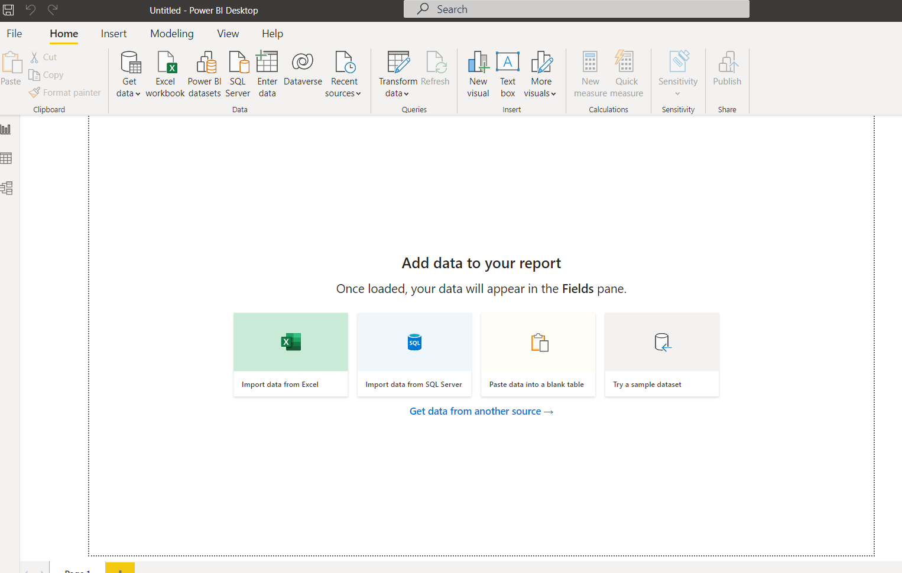

Power BI Project
================

My subject is on how to use Power BI. I am working on a project to learn how to
utilize the tool for data analysis. This information I will learn though this
project will be useful at my place of employment as we are transitioning to
Power BI for numerous reports.

SSA Name Project
----------

I found and downloaded the information for the project from the
SSA website https://www.ssa.gov/oact/babynames/limits.html  This data was in
a zip file as a collection of CSV files with name data for each year in
corresponding files.  This presented the first new task. I needed to find
information on how to load all the files at once. Most of my previous projects
did not come with the number of files that were in this collection. I did not
want to load each file individually as this would take a great deal of time.
When you open a new project in Power Bi on the home tab there is a dropdown
list under “Get data”. In this dropdown, you would usually pick the type of
file you are trying to load.  However, when you want to load multiple files at
once you choose more at the bottom of the dropdown.

Once you have selected the “More” s at the bottom it will open a new pane,
where you will select the folder.  Then press “ok”

This will load the names and ask if you want to combine the files at this time.
We are going to work with the data first in the query editor, so we want to
press “transform data”.

Once the query editor opens with the files, we will work on changing the data
into the form we would like to make working with it easier.

First, we will modify the file name by removing the information before and
after the year so we can use that information in our project.  Choose the
“Transform” tab at the top and extract to choose the delimiters used. I was not
sure if it would work but the I choose between and used the first characters of
the file “yob” as the first delimiter and “.” as the second.   This left only
the “year” in the form of text in the column.

Next, we will add a custom column to display the content of the files,
currently, it is only showing information viewable from the folder, not the
individual file information.  We will accomplish this by adding a custom column
in the “add column” tab using = Csv.document([Content]) as the formula for the
column.  Then click “OK”

We then will get rid of the unneeded columns by deleting them leaving only the
content and the name column.  Select the two columns that you want to keep,
right-click and choose “remove other columns”

Next click on the column that you added with the content and unselect
“use original column name as prefix”

Now you should have the data in a form that is useable. The last couple things
we will do is to remain the columns to represent the data and change the type to
match.

Renaming the columns and changing types is very easy just right click on each
column and choose either rename and or change type.   Once complete click”
close and apply”. This should close the query editor and open the Power Bi
project in the data view.

Now that we have the data loaded into the project, we can start to build some
visuals with it.  I would start by selecting a basic bar chart from the
“Visualizations” on the right. Now choose the data we are going to use in the
chart by having the bar chart selected and clicking on the fields tab.
I chose Name, Qty, Year. The information is too broad for the chart and needs
to be filtered to be useful.

 I choose to make the chart filter with the basic filer option for one name
“Jason”. Then Added Year to the X-axis and QTY (sum) of each year on the Y-axis.

This chart shows how many people were born each year with the first name Jason.
It shows that the name was most popular in the 1970s and started to reduce after
that decade. It is still more popular today than before the 1970s.

Subheading
----------

Aliquam tempus urna diam, eu sagittis magna porta eu. Fusce aliquam nunc vitae
lectus vulputate, quis commodo augue molestie. Vestibulum fermentum nunc odio,
et dapibus eros porttitor at. Phasellus auctor, elit nec ultricies fermentum,
sem augue volutpat mi, eget malesuada metus purus ut dolor. Aenean posuere
tortor ligula, vitae ultrices tellus eleifend ac. Morbi velit magna,
sollicitudin vitae aliquet sed, tincidunt non enim. Vivamus tempus eros ac
purus varius suscipit. Aliquam eu egestas metus.

Morbi augue turpis, imperdiet non turpis quis, consequat varius quam.
Suspendisse imperdiet dapibus arcu viverra aliquam. Fusce eu mauris turpis.
Nullam auctor, purus et imperdiet tristique, lacus lorem vehicula sapien,
a tempus quam ex vitae mi. Cras nec lobortis mi. Integer ultricies ornare
sagittis. Praesent elementum sem justo, vel rhoncus orci fringilla vitae.
Sed gravida urna neque, vel convallis metus dapibus ut. Mauris euismod quam
ante, quis interdum erat viverra id. Aliquam bibendum laoreet odio at imperdiet.
Morbi placerat, leo id tincidunt iaculis, nulla nunc luctus massa, et vulputate
nisi est et nibh. In gravida ut ligula non sodales. Phasellus porttitor varius
iaculis.

Maecenas malesuada blandit tellus, id fringilla sem tempor eget. Morbi maximus
euismod bibendum. Maecenas sit amet dolor ut orci tristique elementum.
Suspendisse scelerisque porta metus, at tincidunt mi. Duis et mauris at enim
finibus maximus. Nunc vel justo ex.

Vivamus ultricies eros ante, nec egestas
lorem fermentum id. Aliquam erat volutpat. Aenean tempus eu mi a elementum.
Donec sit amet iaculis sapien. Proin imperdiet hendrerit sem quis tempus.
Etiam metus augue, ornare consequat magna ut, malesuada mollis erat. Etiam
porta efficitur sapien sed congue. In tristique est urna, sit amet varius
enim finibus sed.