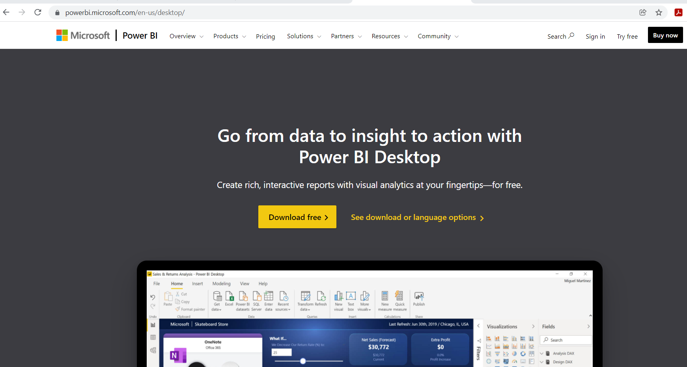
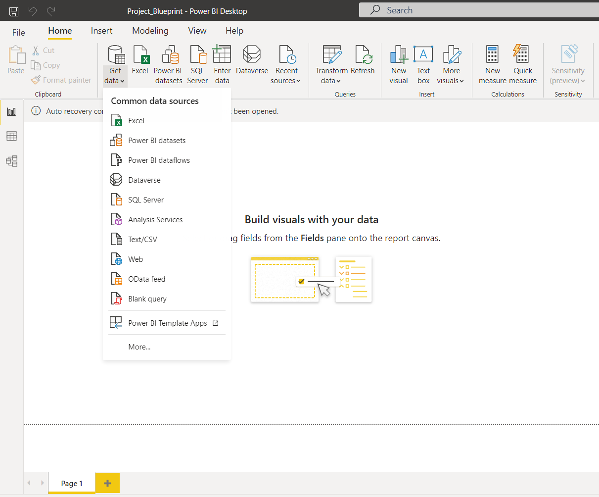
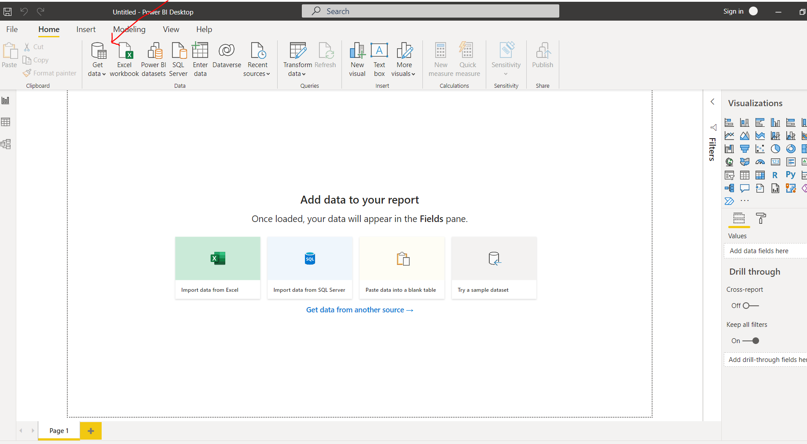
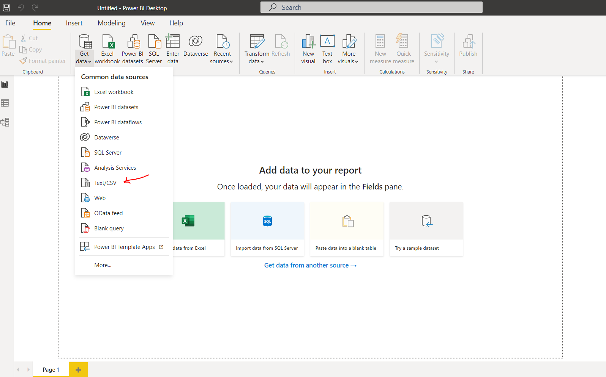
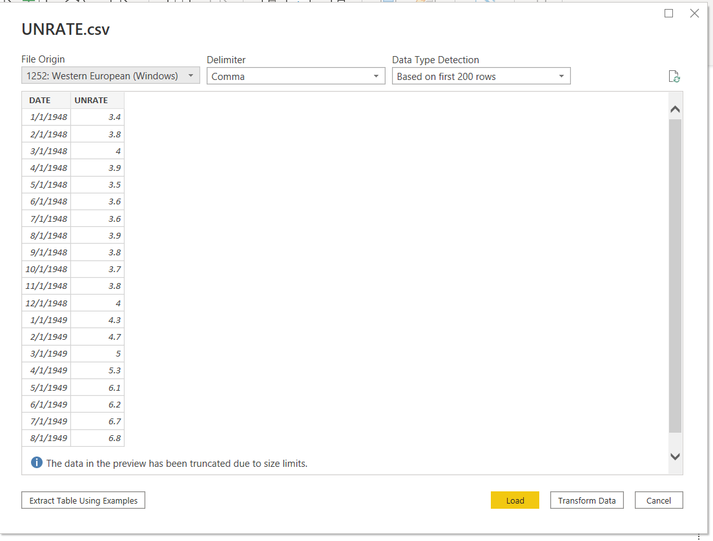
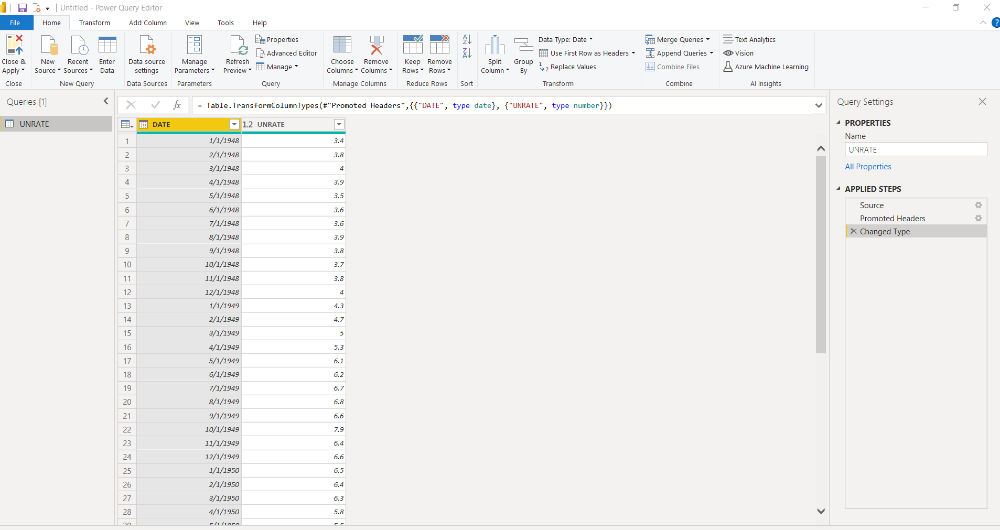
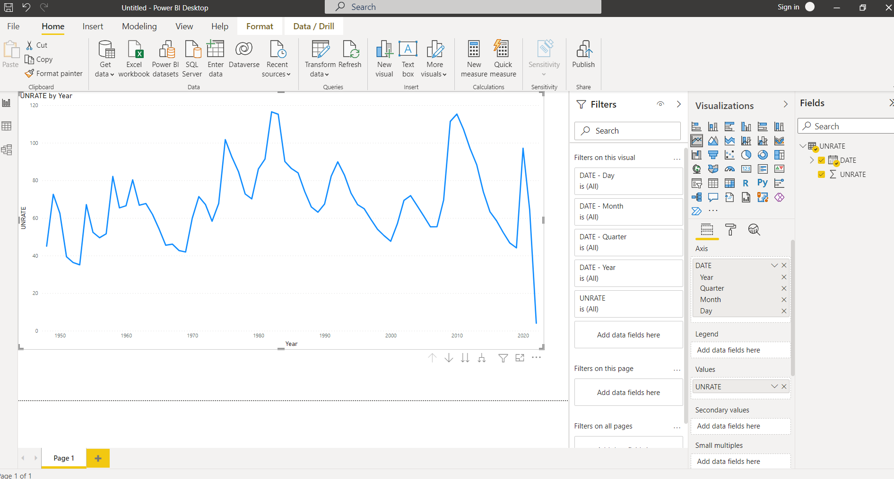

Power BI Project CIS 385
========================

My name is Jason Walburn. I will be documenting my Power BI project here for
CIS 385. During the project I plan on learning the basics of Power BI for
data analysis.

Introduction
------------
Power BI is according to Microsoft " A Business analytics solution that lets you
visualize your data and share insights across your organization. Connect
hundreds of data sources and bring your data to life with live dash boards and
report."  The first part of the project I plan on working though a course
from Udemy. Below is a quick outline the course path below.

* Section 1 : Introduction
* Section 2 : Intro Power BI
* Section 3 : Working in Query Editor
* Section 4 : Understanding the data model
* Section 5 : Creating Visuals
* Section 6 : Cloud with Power BI
* Section 7 : Other Data Sources
* Section 8 : Staying up to date Power BI.

Installing Power BI
-------------------

Go to https://powerbi.microsoft.com/en-us/desktop/

Select Download free

It will redirect to Microsoft Store to allow you to start download.

After downloading open Power BI and a new project

After starting a new project we will need to add data sources.

Go to home ribbon "get data" click on the source you are going to use.

Power BI allows the use of many different types of data. You can use the
WEB connect feature to get data directly from a web source. I tried to do this
with the data from the Federal Reserve Economic Data website. I found that it
was easier on this site to download the file I wanted rather than connect
directly.This is going to be based on the project you are working on and the
way in which the website displays its data.

The data set was downloaded as a CSV file, you would select the file type
from the drop down as shown below and navigate to the location the file is
stored.

After selecting the data set Power Bi will load it into a preview window.
From here you can choose the delimiter for the data and either load into the
Power BI project or click on the transform to work with the data set before
loading it.

I selected transform the data. Once this happens it will load the data into the
the query editor.

There are a lot of tools in the query editor to edit the data before loading
Once you have the data set edited to your liking you can apply and load it
to the project.

Once that is completed you can see the data in the various views of Power BI
One the right side of the screen there are three main views Report, Data, and
Model.  This data set is pretty simple and was chosen as an attempt to load the
data from a website. It can be used to build a visualization of the data in the
report view.

Select the report view.
Choose the data you want to use in the fields menu on the right of the screen
Then select the type of visualization you want the data displayed in.

